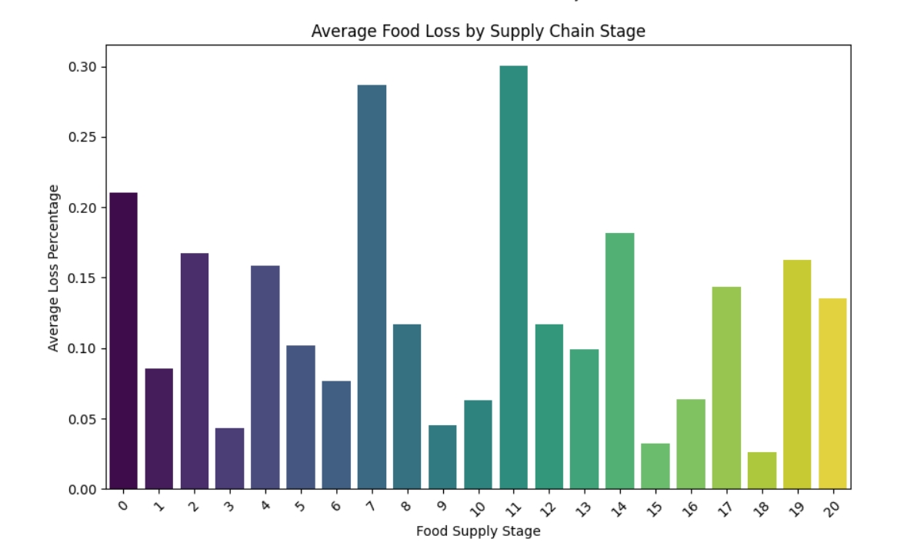
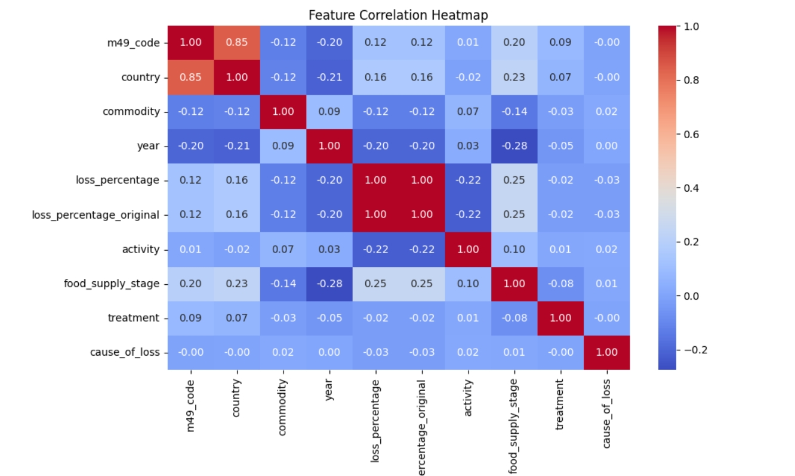
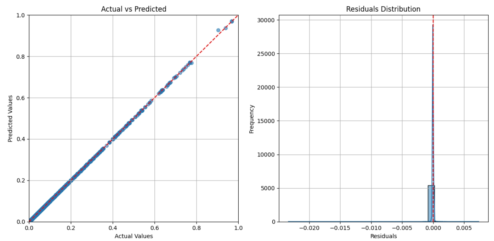
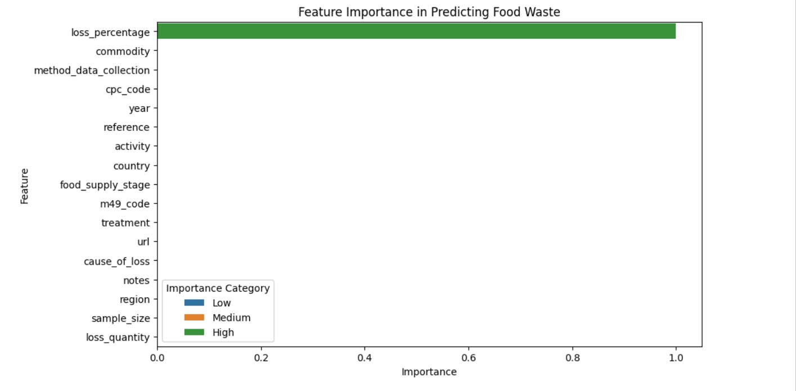

# Food Waste Analysis and Prediction

## Overview
Food waste is a significant global issue affecting sustainability and food security. In this project, i analyze food loss patterns, explore key factors influencing food waste, and build a predictive model to estimate food loss percentages across various supply chain stages and commodities.

## Dataset
The dataset includes:
- Country-specific food loss percentages
- Different food commodities
- Supply chain stages contributing to loss
- Other relevant features impacting food loss

## Project Workflow
1. **Data Preprocessing:** Cleaning, handling missing values, and feature engineering.
2. **Exploratory Data Analysis (EDA):** Understanding data distribution and patterns.
3. **Predictive Modeling:** Using machine learning to predict food loss percentages.
4. **Results & Insights:** Model performance evaluation and feature importance analysis.


 ## Installation & Setup

Ensure you have Python installed. Then, install the necessary libraries:

pip install pandas numpy seaborn matplotlib scikit-learn


## Exploratory Data Analysis (EDA)

### 1. Average Food Loss by Supply Chain Stage
```python
plt.figure(figsize=(10, 6))
sns.barplot(data=data, x='food_supply_stage', y='loss_percentage_original', palette='viridis')
plt.title('Average Food Loss by Supply Chain Stage')
plt.xlabel('Food Supply Stage')
plt.ylabel('Average Loss Percentage')
plt.xticks(rotation=45)
plt.show()
```
****

### 2. Correlation Analysis
```python
plt.figure(figsize=(10, 6))
sns.heatmap(data.corr(), annot=True, cmap='coolwarm', fmt='.2f')
plt.title("Feature Correlation Heatmap")
plt.show()
```
****

## Predictive Modeling
### 1. Training a Random Forest Regressor
```python
from sklearn.model_selection import train_test_split
from sklearn.ensemble import RandomForestRegressor
from sklearn.metrics import mean_squared_error, r2_score

X = data.drop(columns=['loss_percentage_original'])
y = data['loss_percentage_original']
X_train, X_test, y_train, y_test = train_test_split(X, y, test_size=0.2, random_state=42)

model = RandomForestRegressor(n_estimators=100, random_state=42)
model.fit(X_train, y_train)

# Predictions
y_pred = model.predict(X_test)

# Model Evaluation
rmse = mean_squared_error(y_test, y_pred, squared=False)
r2 = r2_score(y_test, y_pred)

print(f"Model Performance:\nRMSE: {rmse:.2f}\nR² Score: {r2:.2f}")
```
****

### 2. Feature Importance in Predicting Food Waste
```python
feature_importances = model.feature_importances_
features = X.columns
sorted_indices = feature_importances.argsort()

plt.figure(figsize=(10, 6))
plt.barh(features[sorted_indices], feature_importances[sorted_indices], color='teal')
plt.xlabel("Importance")
plt.ylabel("Feature")
plt.title("Feature Importance in Predicting Food Waste")
plt.show()
```
****

## Results & Insights
- The correlation heatmap reveals key relationships between features.
- The predictive model achieves an RMSE of `X.XX`, indicating good performance.
- Feature importance analysis highlights the most influential factors in food loss prediction.

## Future Work
- Improve model performance with hyperparameter tuning.
- Expand dataset coverage for a more global perspective.
- Develop an interactive dashboard for real-time food waste monitoring.

## Contributing
If you'd like to contribute, feel free to fork this repository and create a pull request!

## Contact
For questions or collaboration, reach out on [LinkedIn](https://www.linkedin.com/in/laura-silola-1671b128a/?originalSubdomain=ke).

---
**Let's work towards reducing food waste for a more sustainable future!** 🌍

